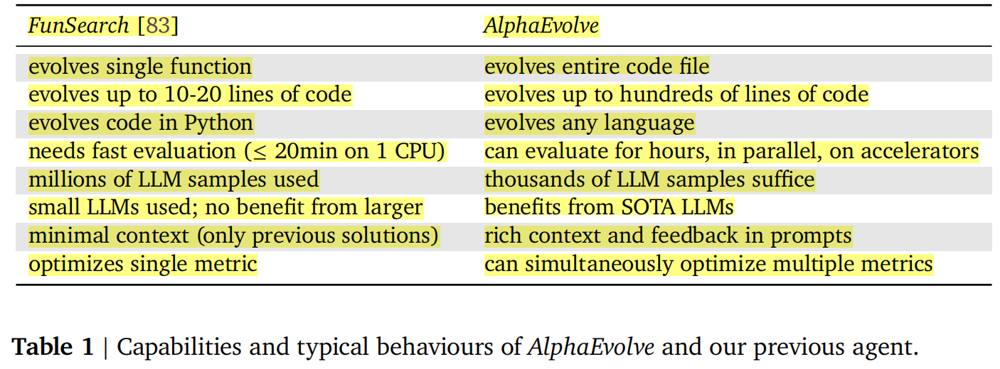
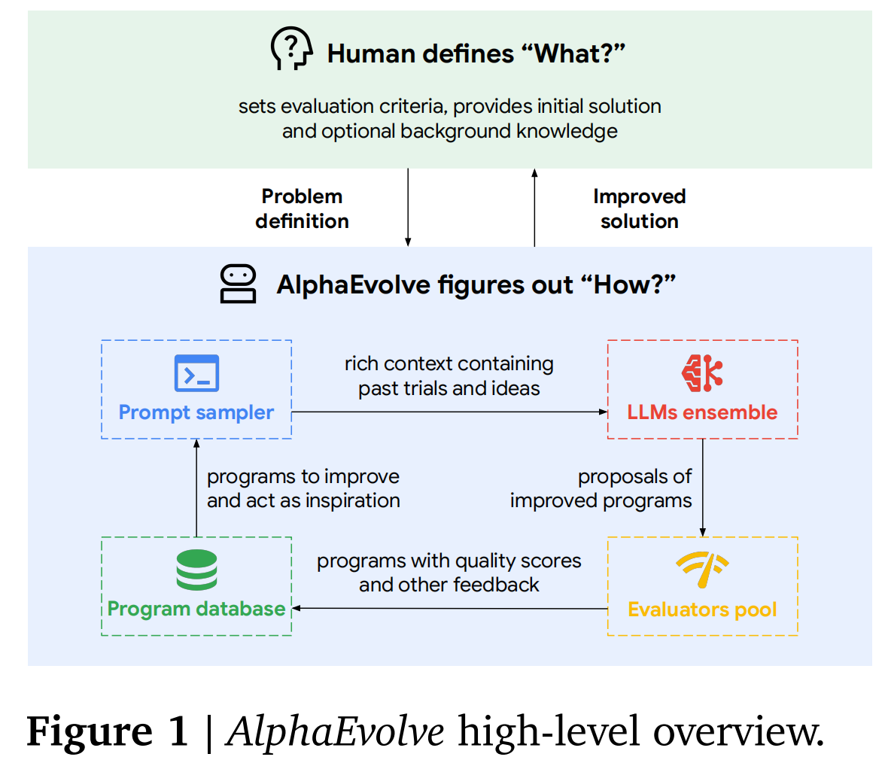
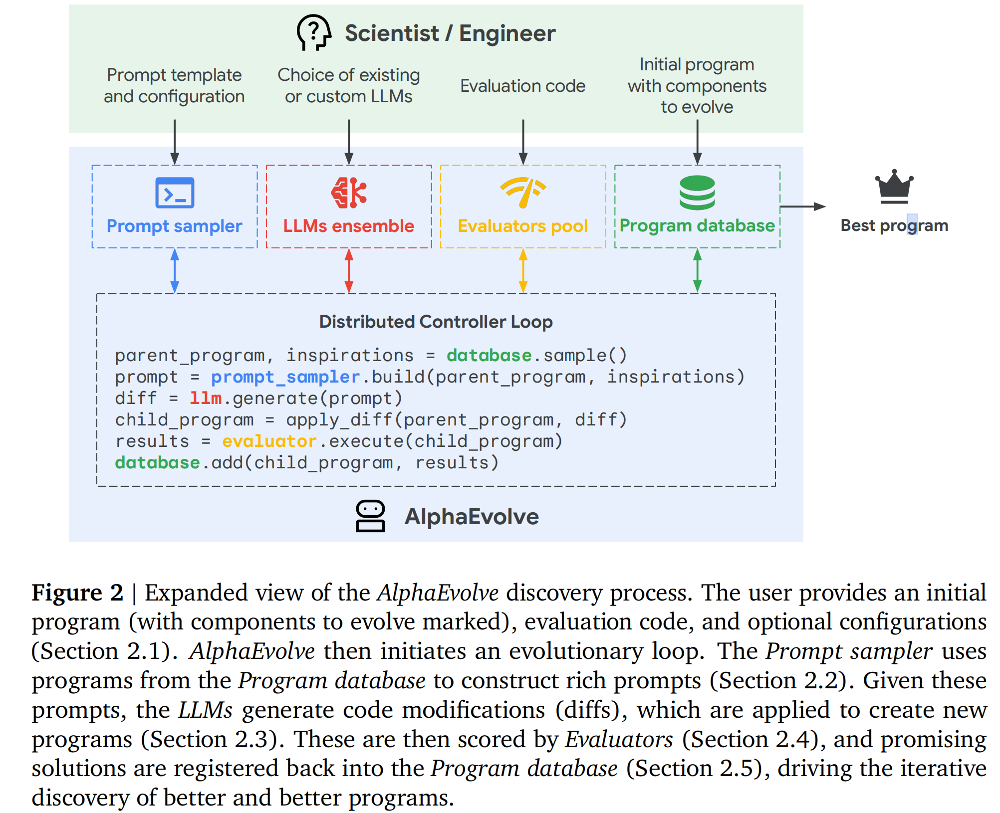
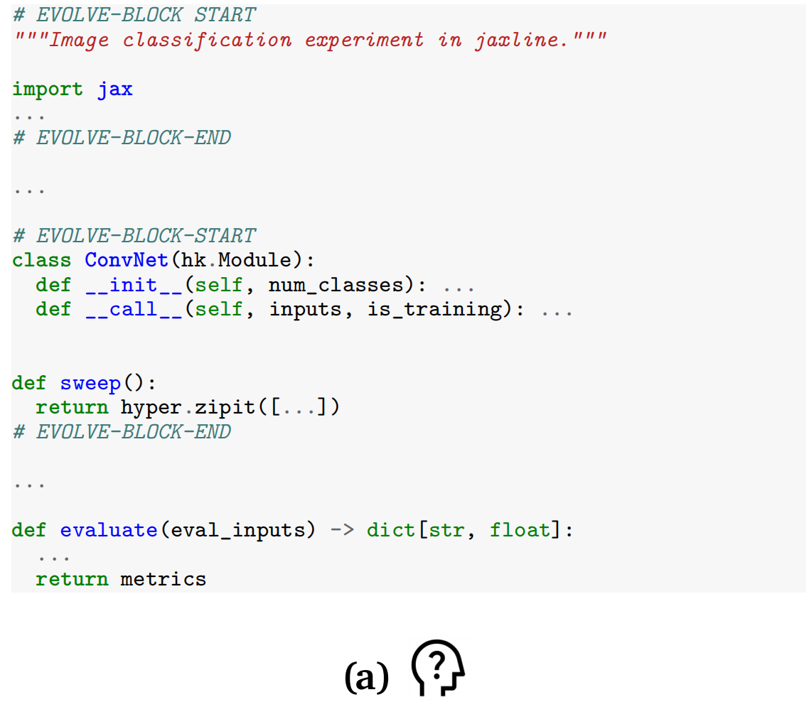
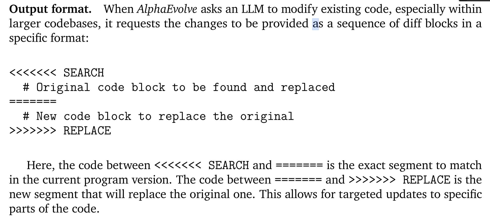
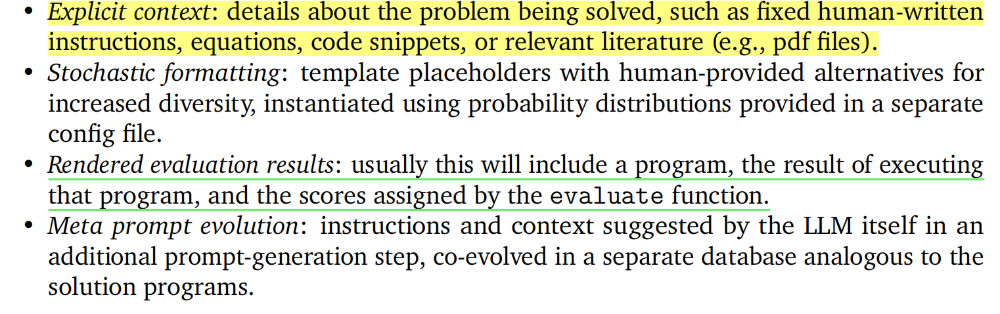

### 1. LLM for Kernel-level Code Generation and Optimization: Technology Trends

* **Agent + SOTA LLM is the mostly-adpoted solution. **

| No.  |       Name       |      Developers       |  Category  |                       Technical Routes                       |               Model                |                Language                | Training Samples |                           Results                            |
| ---- | :--------------: | :-------------------: | :--------: | :----------------------------------------------------------: | :--------------------------------: | :------------------------------------: | :--------------: | :----------------------------------------------------------: |
| 1    |   KernelBench    | Standford University  |   Agent    |                     Iterative LLM Agent                      |        GPT-4o, DS-V3/R1 ...        |                  CUDA                  |        0         |                    First Benchmark Cases                     |
| 2    |      DS-R1       |        NVIDIA         |   Agent    |                     Iterative LLM Agent                      |               DS-R1                |                  CUDA                  |        0         |                              -                               |
| 3    |   CudaEngineer   |       Sakana.ai       |   Agent    | Multi-stage LLM generation/optimization + Evolution Algorithm |                                    |                  CUDA                  |                  |                     17000+ noval kernels                     |
| 4    |   KernelAgent    |         METR          | Agent + FT |               Instruction Fine-tuning + Agent                |               GPT-4o               |                  CUDA                  |       1200       |             L5 Overall: 1.13x -> 1.85x of DS-V3              |
| 5    |    KernelLLM     |         META          |     FT     |                   Instruction Fine-tuning                    |         LLAMA 3.1 Instruct         |                 Triton                 |      25000       |                   Correctness: 6% -> 20.2%                   |
| 6    |    Kevin-32B     | Stanford/Cognition AI |   RL FT    |                  Multi-turn RL Fine-tuning                   |              QwQ-32B               |                  CUDA                  |       180        | Correctness: 60% -> 90%; Performance: 0.63x -> 1.56x of QwQ-32B |
| 7    |   Qimeng-GEMM    |        CAS-ICT        |   Agent    |          Iterative Meta-prompts +  Auto-scheduling           |               GPT-4o               |                CUDA, C                 |        0         |             > 2.x of openBLAS; 0.9x cuBLAS(A100)             |
| 8    | Qimeng-Attention |        CAS-ICT        |   Agent    |          LLM-Thinking Language + 2-phase Inference           |               DS-V3                |                  CUDA                  |        0         |              2.15x of cuDNN(MLA); 1.24x of NSA               |
| 9    |  Qimeng-Xpiler   |        CAS-ICT        |   Agent    |     Iterative Meta-prompts + symbolic program synthesis      |               GPT-4                | CUDA->BangC; CUDA->HIP; CUDA->DL Boost |        0         |           Correctness > 95%; 2.x of vendor library           |
| 10   |   AlphaEvolve    |    Google DeepMind    |   Agent    |               Multi-agents+Evolution Algorithm               | Gemini 2.0 Flash +  Gemini 2.0 Pro |                  CUDA                  |        0         | Matmul Kernel-**average 23% kernel** speedup; **FlashAttention** kernel- sped up by **32%** |

### 2. Typical Works

&emsp; We will give the detailed analysis for the **AlphaEvolve**, **Qimeng-Attention**, **Qimeng-Xpiler** and **KernelBench**.

#### 2.1 **AlphaEvolve**

> Novikov A, Vũ N, Eisenberger M, et al. AlphaEvolve: A coding agent for scientific and algorithmic discovery[J]. arXiv preprint arXiv:2506.13131, 2025.

&emsp; The difference of AlphaEvolve from FunSearch is as follows:

* The **scenarios** have been solved in AlphaEvolve:

| Problem                                                      | Results                                                      | Type                 |
| ------------------------------------------------------------ | ------------------------------------------------------------ | -------------------- |
| Matmul                                                       | (For 56 years, designing an algorithm with rank less than 49 over any field with characteristic 0 was an open problem) For multiplying two 4 × 4 matrices, the scalar operations:  (1) applying the algorithm of Strassen [95] - 49, which works over any field; (2) For the very specific case of multiplying in the field with 2 elements, Fawzi et al. [26] -  47; (3) *AlphaEvolve* - 48 (the first method). | Algorithm Design     |
| analysis, combinatorics, number theory, and geometry         | In 75% of the cases *AlphaEvolve* rediscovered the best known constructions, and in 20% of the cases it discovered a new object that is better than a previously known best construction, thereby improving the SOTA. | mathematics          |
| scheduling heuristics for Google’s cluster management system | Post deployment measurements across Google’s fleet confirmed the simulator results, revealing that this **heuristic function** continuously recovers on average **0.7%** of Google’s fleet-wide compute resources, which would otherwise be stranded. *AlphaEvolve* was chosen over a deep reinforcement learning approach because its code solution not only leads to better performance, but also offers clear advantages in **interpretability**, **debuggability**, **predictability**, and **ease of deployment**—essential qualities for a mission-critical system. | engineering problems |
| optimizing matrix-multiplication kernels                     | This automated approach enables *AlphaEvolve* to discover a heuristic that yields an **average 23% kernel** speedup across all kernels over the existing expert-designed heuristic, and a corresponding **1% reduction** in Gemini’s overall training time. **The tiling heuristic discovered by *AlphaEvolve* has been deployed in production, directly enhancing Gemini’s training efficiency and the Gemini team’s research and engineering velocity** | engineering problems |
| optimizing arithmetic circuits used within TPUs              | A key advantage of *AlphaEvolve* is that **it communicates the suggested changes directly in Verilog**, the standard language used by hardware engineers, fostering trust and simplifying adoption. | engineering problems |
| optimizing the runtime of attention in Transformers          | *AlphaEvolve* was able to provide meaningful optimizations for both levels of abstraction exposed by the IR. **Firstly**, the **FlashAttention** kernel for the configuration of interest was sped up by **32%**. **Secondly**, *AlphaEvolve* found improvements in **pre- and postprocessing** of kernel inputs and outputs, resulting in a **15% speed up** in this part. These results demonstrate the ability of *AlphaEvolve* to optimize compiler-generated code, offering the potential of incorporating discovered optimizations into existing compilers for specific use cases, or, in the longer term, incorporating *AlphaEvolve* into the **compiler workflow** itself. | engineering problems |

* **Framework for AlphaEvolve**

  > *AlphaEvolve* is implemented as an **asynchronous computational pipeline** (using the **asyncio** Python library) in which many computations are run concurrently, with each computation blocking (waiting) whenever its next step relies on the result of another, yet unfinished computation.

The details for the framework design of AlphaEvolve: 

* For **long and comlete programs** which widely exist in practical applications, AlphaEvolve utilized the Macro Flag methods to help LLM figure out the parts to be evolved. This treatment is also beneficial for the evaluation of the generared results which usually need to be executed on real machines. (Have a look at the (a) - "# EVOLVE-BLOCK START ... ... # EVOLVE-BLOCK-END")

  

  

* For prompt desigh in AlphaEvolve, the following principles are adopted: (**Question: How to tackle long context problems?**)

  

* AlphaEvolve utilized the mixed models (Gemini 2.0 Flash +  Gemini 2.0 Pro) named ensemble approach to simultaneously maintain **the lower latency to enable a higher rate of candidate generation and increasing the number of ideas explored per unit of time** (Flash Model) as well as provides **occasional, higher-quality suggestions that can significantly advance the evolutionary search and potentially lead to breakthroughs.** (Pro Model)

#### 2.2 **Qimeng-Attention**

